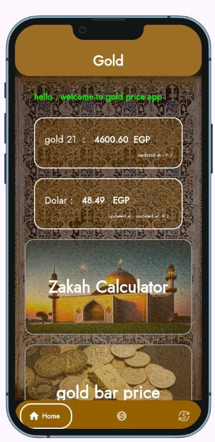
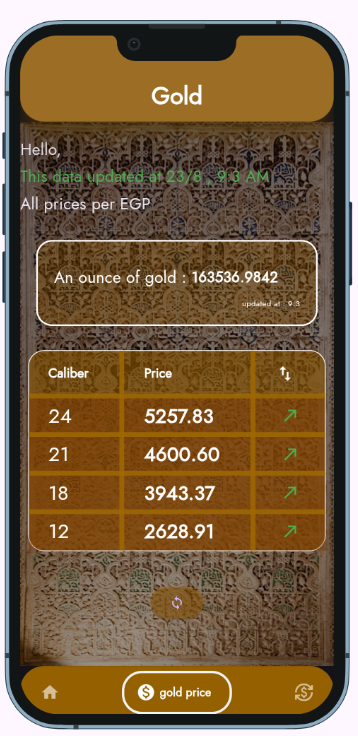
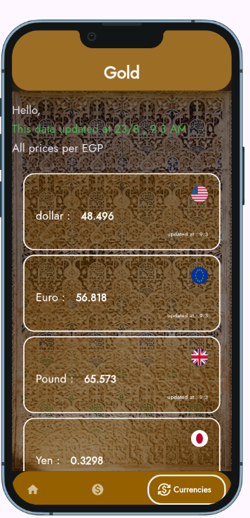
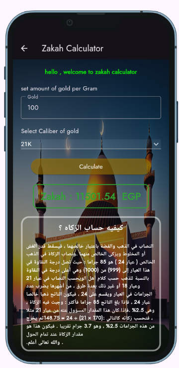
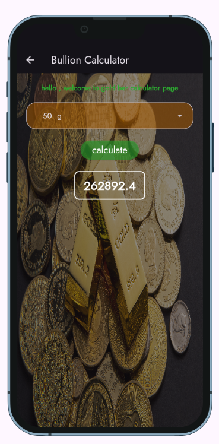

# 💰 Gold & Currency Tracker
    A sophisticated mobile application developed to track real-time gold prices, currency exchange rates against EGP, and calculate Zakat obligations for gold assets.

## 📸 Screenshots

  <table>
    <tr>
      <td align="center">
        
         <b>Home</b>
      </td>
      <td align="center">
        
         <b>Gold Prices</b>
      </td>
      <td align="center">
        
         <b>Currencies prices</b>
      </td>     
    </tr>   
      <tr>
      <td align="center">
        
         <b>Zakat Calculator</b>
      </td>
      <td align="center">
        
         <b>Bullion prices</b>
      </td>         
    </tr>   
  </table>

---
## ✨ Features
### 📊 Real-time Market Data
- Live Gold Prices: Current gold rates per gram in EGP

- Currency Exchange: Real-time exchange rates for major currencies against EGP

- Multi-currency Support: USD, EUR, GBP, KWD, AED, SAR, RUB, OMR, QAR, SDG, CNY, JPY
 
### 🧮 Zakat Calculator
- Islamic Finance Compliance: Accurate Zakat calculation for gold assets

- Customizable Thresholds: Configurable Nisab values based on current gold prices

- Detailed Breakdown: Comprehensive Zakat calculation report

### 🎯 User Experience
   - Intuitive Interface: Clean, modern design with easy navigation

   - Offline Support: Cache mechanism for previously fetched data

   - Notifications: Price alerts and Zakat reminders

   - Dark/Light Theme: Customizable appearance

### 🛠️ Technical Stack
#### Frontend
   - Flutter 3.13.0: Cross-platform framework

   - Dart 3.1.0: Programming language

   - State Management: Bloc/Cubit for predictable state management

   - UI Framework: Material Design 3 with custom themes

#### Backend Integration
   - RESTful APIs: Real-time data integration

   - Dio: Advanced HTTP client for API calls

   - FastForex API: Currency exchange rates

   - MetalsDev API: Precious metals pricing

#### Architecture

    lib
    │── Consts
    │── cubit
    │── data
    │   ├── models
    │   ├── repository
    │   └── wep_sevices
    │── presentation
    │   ├── Pages
    │   └── widgets
    │── main.dart

---

## 📊 API Integration
### Gold Price API
    // Real-time gold price in EGP
    GET https://api.metals.dev/v1/metal/spot?api_key=KEY&metal=gold&currency=EGP
### Currency Exchange API
    // Multi-currency rates against EGP
    GET https://api.fastforex.io/fetch-multi?api_key=KEY&from=EGP&to=USD,EUR,GBP,KWD,AED,SAR...
### 🧮 Zakat Calculation
#### Calculation Formula
   - Zakat Payable = (Gold Weight × Current Price) × 2.5%
   - Nisab Threshold = 87.48 grams × Current Gold Price

### Features
   - Automatic Nisab calculation based on current gold prices

   - Support for different gold purities (24K, 22K, 21K, 18K)

   - Historical calculation records

   - Export functionality for reports
---
## 👨‍💻 Author

### Developed by Amr Ali 🚀
[GitHub](https://github.com/Amr-3li) | [LinkedIn](https://www.linkedin.com/in/amr-ali1/)

---